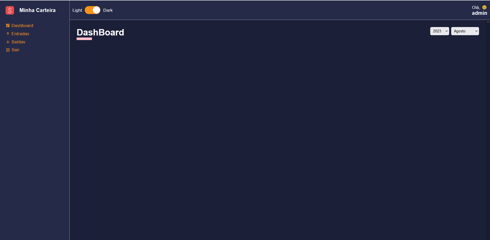
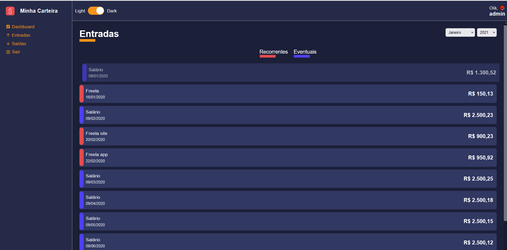

# Criação de projetos React
    * npx create-react-app name-of-your-project
    * npx create-react-app name-of-your-project --template typescript
    * npm create vite@latest

#### Pagens


<br>
<hr>
<br>

#### Ultimo visto
    * https://www.udemy.com/course/react-e-typescript/learn/lecture/21312554#questions
#### Referências
* Rafaela Ballerini 1
```
https://www.youtube.com/watch?v=DqTITcMq68k&t=616s
```
* Rafaela Ballerini 2
```
https://www.youtube.com/watch?v=UBAX-13g8OM&t=781s
```

* Attekita Dev
```
https://www.youtube.com/watch?v=UBAX-13g8OM&t=781s
```
#### React Hooks
#### React Router Dom
#### React ContextApi
#### React Styled-Components
#### React Redux
#### Dependencies
    * npm install --save styled-components
    * npm install --save @types/styled-components
    * npm install react-switch
    * npm install --save react-icons
    * npm install --save @types/react-router-dom
    * npm install --save uuid
### Observações
#### Atualizado para React 18
```sh
    npm create vite@latest
```
    * styled-components  e types
```sh
    npm i styled-components@latest @types/styled-components
```
    * react icons e types
```sh
    npm i react-icons @types/react-icons
```
    * react icons biblioteca consultar icons
```sh
    https://react-icons.github.io/react-icons/icons?name=md
```
#### Problemas Encontrados
    * Video N. 49, Pasta src / hooks/auth.tsx
    * Descrição do problema falta de interface para children
```sh
    https://www.udemy.com/course/react-e-typescript/learn/lecture/21363954#overview
```
    * link Solução
```sh
    https://stackoverflow.com/questions/59106742/typescript-error-property-children-does-not-exist-on-type-reactnode
```

#### Git Comandos Branch

* 1. Cria um novo branch
```
git checkout -b "novoBranch"
```

* 2. lista e mostra o branch atual
```
git branch
```

* 3. munda de branch
```
git checkout main
```

* 4. push na branch desejada
```
git push origin novoBranch
```

* 5. comando para unir o código atual com a outra branch
```
git merge novoBranch
```

* 6. comando para sincronizar repositorio
```
git pull
```